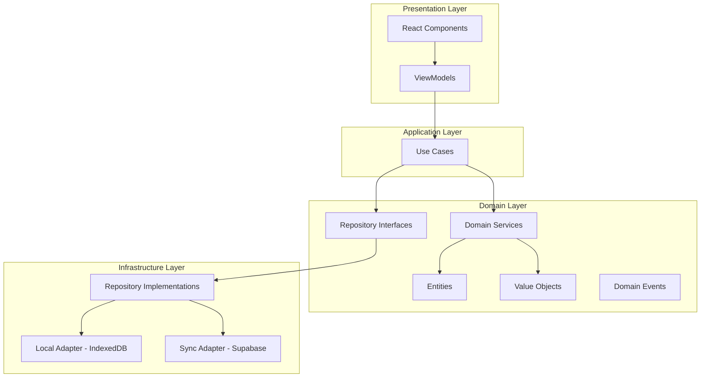

# Design Document

## Overview

Daily Todo PWA использует Vertical Slice + Layered архитектуру с MVVM на презентационном слое. Local-first подход с IndexedDB как источник истины и Supabase для синхронизации.

### Technology Stack

- React 18 + TypeScript
- Zustand (MVVM state management)
- IndexedDB (Dexie.js)
- Supabase (cloud sync)
- Tailwind CSS
- Vite + PWA plugin

## Architecture

### High-Level Architecture



### Vertical Slice Organization

```
src/
├── features/
│   ├── tasks/           # Task CRUD operations
│   ├── today/           # Daily task selection
│   ├── logs/            # Task logging system
│   ├── stats/           # Statistics and analytics
│   └── onboarding/      # User onboarding flow
├── shared/
│   ├── domain/          # Shared domain abstractions
│   ├── infrastructure/  # Shared infrastructure
│   └── ui/              # Shared UI components
└── app/                 # Application shell
```

### MVVM Pattern Implementation

Each feature follows the MVVM pattern:

- **View**: React JSX components (pure presentation)
- **ViewModel**: Zustand stores (state orchestration, UI logic)
- **Model**: Use Cases + Domain Services (business logic)

## Module Interaction

### Feature Module Structure

Каждый feature module содержит:

```
features/tasks/
├── domain/
│   ├── entities/     # Task, TaskId
│   └── services/     # TaskDomainService
├── application/
│   └── use-cases/    # CreateTaskUseCase, CompleteTaskUseCase
├── infrastructure/
│   └── repositories/ # TaskRepositoryImpl
└── presentation/
    ├── components/   # TaskList.tsx, TaskCard.tsx
    └── view-models/  # TaskViewModel (Zustand store)
```

### Component Creation Pattern

При создании нового компонента:

1. **View (React Component)** - только JSX и UI логика
2. **ViewModel (Zustand Store)** - состояние и UI оркестрация
3. **Use Case** - бизнес-логика
4. **Repository** - доступ к данным

```typescript
// View → ViewModel → UseCase → Repository
const TaskList = () => {
  const { tasks, createTask } = useTaskViewModel();
  return <div>{/* JSX */}</div>;
};

const useTaskViewModel = create((set) => ({
  tasks: [],
  createTask: async (title) => {
    await createTaskUseCase.execute({ title });
  }
}));

class CreateTaskUseCase {
  async execute(request): Promise<void> {
    const task = new Task(/* ... */);
    await this.taskRepo.save(task);
  }
}
```

### Core Domain Entities

```typescript
// Value Objects
class TaskId extends ValueObject<string> {} // ULID
class DateOnly extends ValueObject<string> {} // YYYY-MM-DD
class NonEmptyTitle extends ValueObject<string> {}

// Основные сущности
class Task {
  constructor(
    public readonly id: TaskId,
    public title: NonEmptyTitle,
    public category: TaskCategory,
    public status: TaskStatus,
    public readonly createdAt: Date,
    public updatedAt: Date,
    public deletedAt?: Date,
    public readonly inboxEnteredAt?: Date
  ) {}

  changeCategory(newCategory: TaskCategory): DomainEvent[];
  complete(): DomainEvent[];
  revertCompletion(): DomainEvent[];
  isOverdue(overdueDays: number): boolean;
  softDelete(): void;
}

// DailySelection как связующая таблица
interface DailySelectionEntry {
  date: DateOnly;
  taskId: TaskId;
  completedFlag: boolean;
  createdAt: Date;
}
```

### Event System

#### Event Processing Guarantees

Система событий обеспечивает следующие гарантии:

1. **At-least-once processing** - каждое событие будет обработано минимум один раз
2. **Per-aggregate ordered processing** - события от одной сущности обрабатываются в порядке генерации (достигается сериализацией по aggregateId)
3. **Durability** - события персистируются до успешной обработки
4. **Retry with backoff** - автоматические повторы с экспоненциальной задержкой
5. **Dead letter handling** - обработка событий, которые не удалось доставить
6. **Idempotent handlers** - обработчики могут вызываться повторно и должны быть идемпотентны
7. **Post-commit processing** - обработка начинается после commit транзакции, породившей событие

**Ограничения:**

- Нет exactly-once гарантий
- Нет глобального порядка между разными aggregates
- Возможны задержки при backoff
- Возможна повторная обработка событий
- Статистика и производные данные вычисляются из событий; при сбое возможен lag, но будут догнаны при рестарте (replay pending events)

#### Event Store Schema

```typescript
interface EventStoreRecord {
  id: string; // ULID (primary key)
  aggregateId: string;
  aggregateType: string;
  eventType: string;
  eventData: string;
  createdAt: number; // Date.now()
  status: "pending" | "processing" | "done" | "dead";
  attemptCount: number;
  nextAttemptAt?: number;
  lastError?: string;
}

interface HandledEventRecord {
  eventId: string;
  handlerId: string;
  processedAt: number;
}

interface LockRecord {
  id: string;
  expiresAt: number;
}

// Обновляем TodoDatabase
class TodoDatabase extends Dexie {
  tasks!: Table<TaskRecord>;
  dailySelectionEntries!: Table<DailySelectionEntryRecord>;
  taskLogs!: Table<TaskLogRecord>;
  userSettings!: Table<UserSettingsRecord>;
  syncQueue!: Table<SyncQueueRecord>;
  statsDaily!: Table<StatsDailyRecord>;
  eventStore!: Table<EventStoreRecord>;
  handledEvents!: Table<HandledEventRecord>;
  locks!: Table<LockRecord>;

  constructor() {
    super("TodoDatabase");

    // Migration from version 1 to 2
    this.version(1).stores({
      tasks:
        "++id, category, status, createdAt, updatedAt, deletedAt, inboxEnteredAt",
      dailySelectionEntries: "++[date+taskId], date, taskId, completedFlag",
      taskLogs: "++id, taskId, type, createdAt",
      userSettings: "++key",
      syncQueue:
        "++id, entityType, entityId, operation, attemptCount, createdAt",
      statsDaily: "++date, simpleCompleted, focusCompleted, inboxReviewed",
    });

    this.version(2)
      .stores({
        tasks:
          "id, category, status, createdAt, updatedAt, deletedAt, inboxEnteredAt",
        dailySelectionEntries: "[date+taskId], date, taskId, completedFlag",
        taskLogs: "id, taskId, type, createdAt",
        userSettings: "key",
        syncQueue:
          "id, entityType, entityId, operation, attemptCount, createdAt, nextAttemptAt",
        statsDaily: "date, simpleCompleted, focusCompleted, inboxReviewed",
        eventStore:
          "id, status, aggregateId, aggregateId+createdAt, nextAttemptAt, attemptCount",
        handledEvents: "[eventId+handlerId], eventId, handlerId",
        locks: "id, expiresAt",
      })
      .upgrade((trans) => {
        // Data migration logic if needed
        console.log("Upgrading database to version 2");
      });
  }
}
```

#### Persistent EventBus Implementation

```typescript
interface EventHandler {
  id: string;
  handle(event: DomainEvent): Promise<void>;
}

interface EventBus {
  publishAll(events: DomainEvent[]): Promise<void>;
  subscribe<T extends DomainEvent>(
    eventType: string,
    handler: EventHandler
  ): EventSubscription;
  startProcessingLoop(): void;
}

class PersistentEventBus implements EventBus {
  private readonly MAX_RETRY_ATTEMPTS = 5;
  private readonly RETRY_BASE_DELAY = 1000; // ms

  async publishAll(events: DomainEvent[]): Promise<void> {
    // Только сохраняем события в транзакции, не обрабатываем
    const eventRecords = events.map((event) => ({
      id: ulid(),
      aggregateId: event.aggregateId,
      eventType: event.eventType,
      eventData: JSON.stringify(event),
      createdAt: Date.now(),
      status: "pending" as const,
      attemptCount: 0,
    }));

    await this.database.eventStore.bulkAdd(eventRecords);

    // Запускаем обработку после commit транзакции
    if (Dexie.currentTransaction) {
      Dexie.currentTransaction.on("complete", () => {
        queueMicrotask(() => this.processNextBatch());
      });
    }
  }

  private async processNextBatch(): Promise<void> {
    // Получаем pending события, группируем по aggregateId для порядка
    // Обрабатываем handlers последовательно с проверкой handledEvents
    // Retry с exponential backoff + jitter при ошибках
  }

  private async executeHandler(
    handler: EventHandler,
    event: DomainEvent,
    eventId: string
  ): Promise<void> {
    // Проверяем handledEvents для идемпотентности
    const alreadyHandled = await this.database.handledEvents
      .where(["eventId", "handlerId"])
      .equals([eventId, handler.id])
      .first();

    if (alreadyHandled) return;

    await handler.handle(event);

    // Записываем успешную обработку
    await this.database.handledEvents.add({
      eventId,
      handlerId: handler.id,
      processedAt: Date.now(),
    });
  }
}
```

#### Transactional Event Publishing

```typescript
// UseCase с транзакционной публикацией событий
class CompleteTaskUseCase {
  constructor(
    private taskRepo: TaskRepository,
    private eventBus: EventBus,
    private database: TodoDatabase
  ) {}

  async execute(taskId: TaskId): Promise<Result<void, DomainError>> {
    // Используем транзакцию для атомарности
    return await this.database.transaction(
      "rw",
      [this.database.tasks, this.database.syncQueue, this.database.eventStore],
      async () => {
        const task = await this.taskRepo.findById(taskId);
        if (!task) return Result.error(new TaskNotFoundError(taskId));

        const events = task.complete();

        // Сохраняем изменения и события в одной транзакции
        // 1. Mutate task
        await this.taskRepo.save(task);

        // 2. Add syncQueue entry
        await this.database.syncQueue.add({
          id: ulid(),
          entityType: "task",
          entityId: task.id.value,
          operation: "update",
          payloadHash: hashObject(task),
          attemptCount: 0,
          createdAt: new Date(),
          nextAttemptAt: Date.now(),
        });

        // 3. Add eventStore records
        await this.eventBus.publishAll(events);

        // Никаких обработчиков внутри транзакции
        return Result.ok();
      }
    );
  }
}
```

#### Event Processing Monitoring

```typescript
interface EventProcessingStats {
  totalEvents: number;
  pendingEvents: number;
  processingEvents: number;
  doneEvents: number;
  deadLetterEvents: number;
  averageProcessingTime: number;
}

class EventMonitor {
  constructor(private database: TodoDatabase) {}

  async getProcessingStats(): Promise<EventProcessingStats> {
    const [total, pending, processing, done, deadLetter] = await Promise.all([
      this.database.eventStore.count(),
      this.database.eventStore.where("status").equals("pending").count(),
      this.database.eventStore.where("status").equals("processing").count(),
      this.database.eventStore.where("status").equals("done").count(),
      this.database.eventStore.where("status").equals("dead").count(),
    ]);

    return {
      totalEvents: total,
      pendingEvents: pending,
      processingEvents: processing,
      doneEvents: done,
      deadLetterEvents: deadLetter,
      averageProcessingTime: 0, // TODO: implement timing with startedAt/finishedAt
    };
  }

  async getDeadLetterEvents(): Promise<EventStoreRecord[]> {
    return await this.database.eventStore
      .where("status")
      .equals("dead")
      .toArray();
  }

  async reprocessDeadLetterEvent(eventId: string): Promise<void> {
    await this.database.eventStore.update(eventId, {
      status: "pending" as const,
      attemptCount: 0,
      lastError: undefined,
      nextAttemptAt: Date.now(),
    });
  }
}
```

#### Event Cleanup Strategy

```typescript
class EventCleanupService {
  constructor(private database: TodoDatabase) {}

  async cleanupProcessedEvents(olderThanDays: number = 30): Promise<number> {
    const cutoffDate = Date.now() - olderThanDays * 24 * 60 * 60 * 1000;

    // Удаляем done события старше N дней пачками, но не если есть связанные handledEvents
    const doneEvents = await this.database.eventStore
      .where("status")
      .equals("done")
      .and((record) => record.createdAt < cutoffDate)
      .toArray();

    let deletedCount = 0;
    for (const event of doneEvents) {
      // Удаляем связанные handledEvents
      await this.database.handledEvents
        .where("eventId")
        .equals(event.id)
        .delete();

      // Удаляем само событие
      await this.database.eventStore.delete(event.id);
      deletedCount++;
    }

    return deletedCount;
  }

  async archiveDeadLetterEvents(): Promise<void> {
    // Не трогать dead без архива
    const deadLetterEvents = await this.database.eventStore
      .where("status")
      .equals("dead")
      .toArray();

    // TODO: implement archiving logic (export to file or external service)
    console.log(
      `Found ${deadLetterEvents.length} dead letter events to archive`
    );
  }
}
```

#### Idempotency Patterns

Обработчики событий должны быть идемпотентными и следовать этим паттернам:

```typescript
// 1. UPSERT логов
class TaskLogEventHandler implements EventHandler {
  id = "task-log-handler";

  async handle(event: TaskCompletedEvent): Promise<void> {
    // Используем UPSERT для идемпотентности
    await this.database.taskLogs.put({
      id: `${event.aggregateId}-completed-${event.createdAt}`,
      taskId: event.aggregateId,
      type: "SYSTEM",
      action: "completed",
      createdAt: event.createdAt,
    });
  }
}

// 2. Проверка existing перед вставкой
class StatsUpdateHandler implements EventHandler {
  id = "stats-update-handler";

  async handle(event: TaskCompletedEvent): Promise<void> {
    const dateKey = new Date(event.createdAt).toISOString().split("T")[0];

    // Проверяем существующую запись
    const existing = await this.database.statsDaily.get(dateKey);
    if (existing) {
      // Обновляем только если событие новее последнего обновления
      if (event.createdAt > existing.lastUpdated) {
        await this.database.statsDaily.update(dateKey, {
          simpleCompleted: existing.simpleCompleted + 1,
          lastUpdated: event.createdAt,
        });
      }
    } else {
      await this.database.statsDaily.add({
        date: dateKey,
        simpleCompleted: 1,
        focusCompleted: 0,
        inboxReviewed: 0,
        lastUpdated: event.createdAt,
      });
    }
  }
}

// 3. Использование handledEvents для дедупликации
class NotificationHandler implements EventHandler {
  id = "notification-handler";

  async handle(event: TaskOverdueEvent): Promise<void> {
    // handledEvents проверка уже выполнена в EventBus
    // Можем безопасно отправлять уведомление
    await this.notificationService.send({
      title: "Task Overdue",
      body: `Task "${event.taskTitle}" is overdue`,
      timestamp: Date.now(), // Фиксируем время в событии, не зависим от внешнего времени
    });
  }
}
```

## Data Models

### Database Schema (IndexedDB)

```typescript
class TodoDatabase extends Dexie {
  tasks!: Table<TaskRecord>;
  dailySelectionEntries!: Table<DailySelectionEntryRecord>;
  taskLogs!: Table<TaskLogRecord>;
  userSettings!: Table<UserSettingsRecord>;
  syncQueue!: Table<SyncQueueRecord>;
  statsDaily!: Table<StatsDailyRecord>;

  constructor() {
    super("TodoDatabase");

    this.version(1).stores({
      tasks:
        "++id, category, status, createdAt, updatedAt, deletedAt, inboxEnteredAt",
      dailySelectionEntries: "++[date+taskId], date, taskId, completedFlag",
      taskLogs: "++id, taskId, type, createdAt",
      userSettings: "++key",
      syncQueue:
        "++id, entityType, entityId, operation, attemptCount, createdAt",
      statsDaily: "++date, simpleCompleted, focusCompleted, inboxReviewed",
    });
  }
}
```

### Sync Engine Specification

#### Outbox Pattern

```typescript
interface SyncQueueRecord {
  id: string;
  entityType: "task" | "dailySelectionEntry" | "taskLog";
  entityId: string;
  operation: "create" | "update" | "delete";
  payloadHash: string;
  attemptCount: number;
  createdAt: Date;
  lastAttemptAt?: Date;
}
```

#### Pull Strategy

```typescript
interface SyncCursor {
  lastSyncTimestamp: Date;
  entityCursors: {
    tasks: string;
    dailySelectionEntries: string;
    taskLogs: string;
  };
}
```

#### Conflict Resolution

```typescript
interface ConflictCriteria {
  updatedAtDiff: boolean; // different updatedAt timestamps
  contentHashDiff: boolean; // different content hashes
  tieBreaker: "originDeviceId"; // when updatedAt is equal
}
```

## Error Handling

### Error Types and Strategies

```typescript
// Domain errors
class DomainError extends Error {
  constructor(
    message: string,
    public readonly code: string
  ) {
    super(message);
    this.name = "DomainError";
  }
}

class TaskNotFoundError extends DomainError {
  constructor(taskId: TaskId) {
    super(`Task with id ${taskId.value} not found`, "TASK_NOT_FOUND");
  }
}

class InvalidTaskStateError extends DomainError {
  constructor(message: string) {
    super(message, "INVALID_TASK_STATE");
  }
}

// Infrastructure errors
class SyncError extends Error {
  constructor(
    message: string,
    public readonly retryable: boolean = true
  ) {
    super(message);
    this.name = "SyncError";
  }
}

class StorageError extends Error {
  constructor(
    message: string,
    public readonly operation: string
  ) {
    super(message);
    this.name = "StorageError";
  }
}
```

### Uniform Error Envelope

```typescript
// Единый тип результата UseCase
type Result<T, E> = { success: true; data: T } | { success: false; error: E };

class CreateTaskUseCase {
  async execute(
    request: CreateTaskRequest
  ): Promise<Result<Task, DomainError | InfraError>> {
    try {
      const task = new Task(/* ... */);
      await this.taskRepo.save(task);
      return { success: true, data: task };
    } catch (error) {
      return { success: false, error: error as DomainError };
    }
  }
}
```

### Error Handling Strategy

1. **Domain Layer**: Минимизировать throw, использовать Result<T, E>
2. **Application Layer**: Обрабатывает Result и конвертирует в UI responses
3. **Infrastructure Layer**: Retry логика с экспоненциальной задержкой
4. **Presentation Layer**: Единообразные error envelopes

### Offline Error Handling

```typescript
class OfflineErrorHandler {
  static handle(error: Error): ErrorResponse {
    if (error instanceof SyncError && !navigator.onLine) {
      return {
        type: "warning",
        message: "Changes saved locally. Will sync when online.",
        action: "dismiss",
      };
    }

    if (error instanceof StorageError) {
      return {
        type: "error",
        message: "Unable to save changes. Please try again.",
        action: "retry",
      };
    }

    return {
      type: "error",
      message: "An unexpected error occurred.",
      action: "report",
    };
  }
}
```

## Testing Strategy

### Testing Pyramid

1. **Unit Tests (70%)**
   - Domain entities and value objects
   - Use cases and domain services
   - Pure functions and utilities

2. **Integration Tests (20%)**
   - Repository implementations
   - Sync adapters
   - API endpoints

3. **E2E Tests (10%)**
   - Critical user journeys
   - PWA functionality
   - Offline scenarios

### Test Organization

```typescript
// Domain entity tests
describe("Task Entity", () => {
  it("should create task with valid data", () => {
    const task = new Task(
      TaskId.generate(),
      "Test task",
      TaskCategory.SIMPLE,
      TaskStatus.ACTIVE,
      new Date(),
      new Date()
    );

    expect(task.title).toBe("Test task");
    expect(task.category).toBe(TaskCategory.SIMPLE);
  });

  it("should emit domain events when changing category", () => {
    const task = createInboxTask();

    const events = task.changeCategory(TaskCategory.FOCUS);

    expect(events).toHaveLength(2);
    expect(events[0]).toBeInstanceOf(TaskReviewedEvent);
    expect(events[1]).toBeInstanceOf(TaskCategoryChangedEvent);
  });
});

// Use case tests
describe("CompleteTaskUseCase", () => {
  it("should complete task and create log", async () => {
    const mockRepo = createMockTaskRepository();
    const mockLogRepo = createMockLogRepository();
    const useCase = new CompleteTaskUseCase(mockRepo, mockLogRepo);

    await useCase.execute(taskId);

    expect(mockRepo.save).toHaveBeenCalled();
    expect(mockLogRepo.save).toHaveBeenCalledWith(
      expect.objectContaining({ type: LogType.SYSTEM })
    );
  });
});
```

### PWA Testing

```typescript
// Service worker tests
describe("Service Worker", () => {
  it("should cache app shell resources", async () => {
    const cache = await caches.open("app-shell-v1");
    const cachedRequests = await cache.keys();

    expect(cachedRequests.map((req) => req.url)).toContain("/index.html");
    expect(cachedRequests.map((req) => req.url)).toContain("/manifest.json");
  });

  it("should serve cached content when offline", async () => {
    // Mock offline scenario
    jest.spyOn(navigator, "onLine", "get").mockReturnValue(false);

    const response = await fetch("/");

    expect(response.ok).toBe(true);
    expect(response.headers.get("x-served-by")).toBe("sw-cache");
  });
});
```

### Sync Testing

```typescript
describe("Sync Engine", () => {
  it("should resolve conflicts using last-write-wins", async () => {
    const localTask = createTask({ updatedAt: new Date("2023-01-01") });
    const remoteTask = createTask({ updatedAt: new Date("2023-01-02") });

    const resolved = await syncEngine.resolveConflict(localTask, remoteTask);

    expect(resolved).toEqual(remoteTask);
    expect(mockLogRepo.save).toHaveBeenCalledWith(
      expect.objectContaining({ type: LogType.CONFLICT })
    );
  });
});
```

This design document provides a comprehensive foundation for implementing the Daily Todo PWA with all the architectural patterns and requirements specified. The design emphasizes maintainability, testability, and scalability while ensuring a great user experience across all devices.

## Key Design Decisions

### State Management Strategy

Чистый MVVM через Zustand + собственные query selectors.

### Daily Selection Pattern

Таблица связей daily_selection_entries (date, taskId, completedFlag) с UNIQUE(date, taskId) для idempotent upsert операций.

### Statistics Snapshot Strategy

Nightly snapshot в stats_daily (date, simpleCompleted, focusCompleted, inboxReviewed). Старые SYSTEM логи completion/review можно удалять после снапшота.

### Log Retention Enforcement

Фоновая задача при старте + после добавления лога. Не в request path UI для производительности.

### Security

- Supabase session аутентификация
- Access token в secure storage
- Logout очищает IndexedDB namespace

### Conflict Log Format

```typescript
{
  type: 'CONFLICT',
  metadata: {
    entityType: 'task',
    entityId: 'task_123',
    localUpdatedAt: '2023-01-01T10:00:00Z',
    remoteUpdatedAt: '2023-01-01T10:01:00Z',
    winner: 'remote'
  }
}
```

### Performance Instrumentation

```typescript
performance.mark("task_update_start");
// ... operation
performance.mark("task_update_end");
performance.measure("task_update", "task_update_start", "task_update_end");
```

### Extended Test Suite

- Контрактный тест адаптера (create/list/update/delete/conflict)
- Race тест: два устройства меняют одну задачу → проверить LWW и лог
- Performance тесты с p95 метриками
