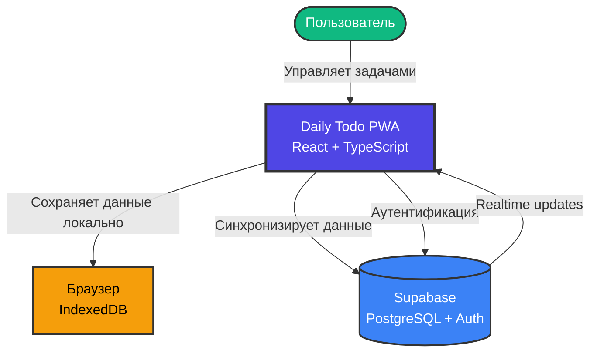
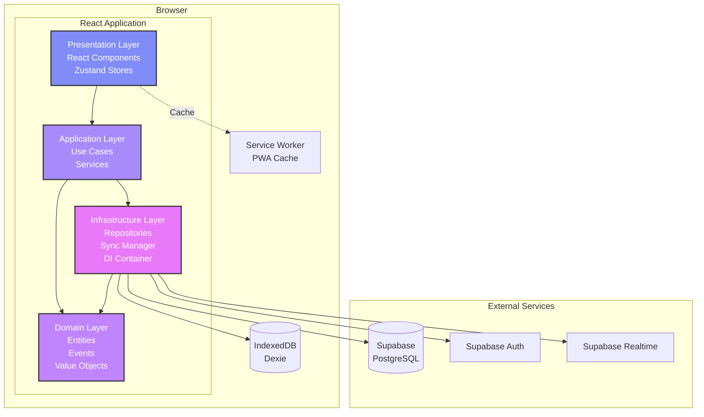
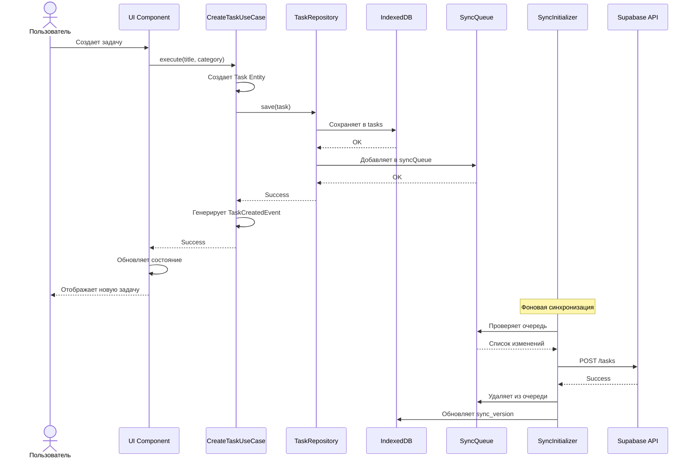
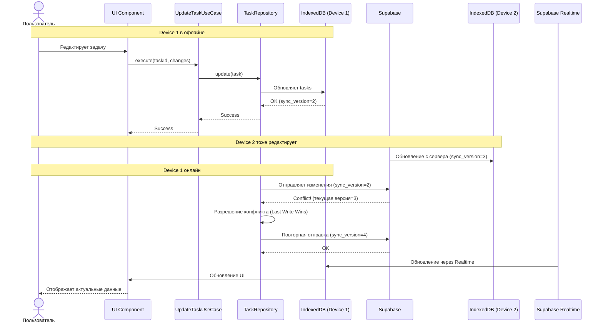
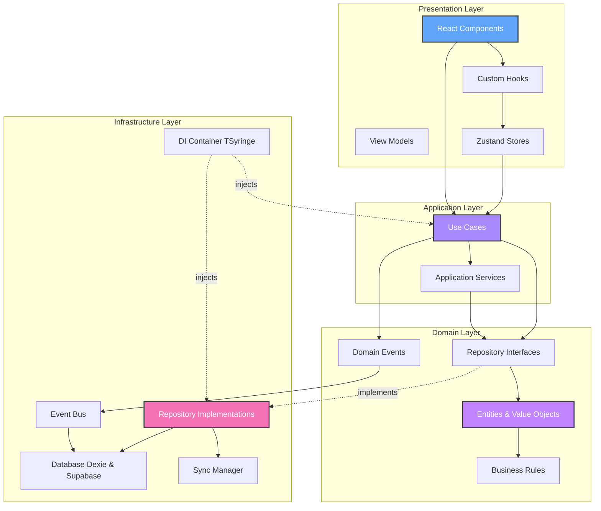

# Daily Todo PWA

[](https://codecov.io/gh/k-egor-smirnov/lift)

Прогрессивное веб-приложение для управления ежедневными задачами с фокусом на продуктивность и организацию.

## Содержание

- [Основные возможности](#основные-возможности)
- [Технологический стек](#технологический-стек)
- [Архитектура](#архитектура)
  - [Обзор](#обзор)
  - [Структура каталогов](#структура-каталогов)
  - [Основные модули и слои](#основные-модули-и-слои)
  - [Потоки данных](#потоки-данных)
  - [Данные и хранилища](#данные-и-хранилища)
  - [Интеграции](#интеграции)
  - [Запуск и окружения (обзор)](#запуск-и-окружения-обзор)
  - [Диаграммы](#диаграммы)
  - [Решения и trade-offs](#решения-и-trade-offs)
- [Быстрый старт](#быстрый-старт)
- [Эксплуатация и окружения](#эксплуатация-и-окружения)
- [CI/CD](#cicd)

## Основные возможности

- **Управление задачами**: создание, редактирование, выполнение и удаление задач с категоризацией
- **Ежедневный фокус**: представление "Сегодня" для выбора и фокуса на ежедневных задачах
- **Категории задач**: Inbox (новые), Simple (быстрые), Focus (важные/сложные), Deferred (отложенные)
- **Логирование задач**: отслеживание активности и истории задач
- **Статистика**: аналитика выполнения задач и продуктивности
- **Офлайн-режим**: работа без интернета через IndexedDB с автоматической синхронизацией

## Технологический стек

### Frontend

- **React 18** с TypeScript — основной фреймворк для UI
- **Vite** — инструмент сборки и dev-сервер
- **PWA** — Progressive Web App с Service Worker
- **Tailwind CSS** — utility-first CSS фреймворк
- **Radix UI** — библиотека доступных UI-компонентов
- **Framer Motion** — анимации
- **i18next** — интернационализация

### Управление состоянием и данными

- **Zustand** — легковесное управление состоянием приложения
- **TSyringe** — Dependency Injection контейнер
- **Dexie** — обертка над IndexedDB для локального хранения
- **@supabase/supabase-js** — клиент для работы с Supabase

### Тестирование

- **Vitest** — unit и integration тесты
- **Testing Library** — тестирование React компонентов
- **Playwright** — E2E тестирование
- **fake-indexeddb** — мок IndexedDB для тестов

### Дополнительные инструменты

- **date-fns** — работа с датами
- **ulid** — генерация уникальных идентификаторов
- **@dnd-kit** — drag and drop функциональность
- **ESLint** — линтинг кода
- **Prettier** — форматирование кода
- **Husky** — git hooks

## Архитектура

### Обзор

Приложение построено на принципах **Clean Architecture** и **Domain-Driven Design (DDD)**. Архитектура разделена на четкие слои с односторонними зависимостями: внешние слои зависят от внутренних, но не наоборот.

Ключевые архитектурные решения:

- **Local-first подход**: данные сначала сохраняются локально в IndexedDB, затем синхронизируются с сервером
- **Dependency Injection**: использование TSyringe для инверсии зависимостей
- **Event-driven**: доменные события для слабой связанности модулей
- **Offline-first**: приложение работает без подключения к интернету
- **Progressive Web App**: установка на устройство, push-уведомления, offline-режим

### Структура каталогов

```
/
├── src/
│   ├── shared/                    # Общий код, переиспользуемый код
│   │   ├── domain/               # Доменный слой
│   │   │   ├── entities/        # Сущности (Task, DailySelectionEntry)
│   │   │   ├── events/          # Доменные события
│   │   │   ├── repositories/    # Интерфейсы репозиториев
│   │   │   └── value-objects/   # Value Objects
│   │   ├── application/         # Слой приложения
│   │   │   ├── use-cases/       # Use Cases (бизнес-логика)
│   │   │   └── services/        # Сервисы приложения
│   │   ├── infrastructure/      # Инфраструктурный слой
│   │   │   ├── database/        # IndexedDB (Dexie) и Supabase
│   │   │   ├── repositories/    # Реализации репозиториев
│   │   │   ├── sync/            # Механизм синхронизации
│   │   │   ├── di/              # DI контейнер (TSyringe)
│   │   │   ├── config/          # Конфигурация (Supabase и др.)
│   │   │   ├── events/          # Адаптеры событий
│   │   │   └── services/        # Инфраструктурные сервисы
│   │   ├── presentation/        # Слой представления
│   │   │   ├── contexts/        # React контексты
│   │   │   ├── hooks/           # Custom React hooks
│   │   │   └── view-models/     # View Models
│   │   ├── ui/                  # UI компоненты (переиспользуемые)
│   │   ├── lib/                 # Библиотеки и утилиты (i18n и др.)
│   │   └── utils/               # Вспомогательные функции
│   ├── features/                # Модули фичей (Feature Slices)
│   │   ├── tasks/              # Управление задачами
│   │   ├── today/              # Экран "Сегодня"
│   │   ├── logs/               # Логи и история
│   │   ├── stats/              # Статистика
│   │   ├── settings/           # Настройки
│   │   └── onboarding/         # Онбординг
│   ├── mvp/                    # MVP реализация приложения
│   │   ├── MVPApp.tsx         # Главный компонент MVP
│   │   └── components/        # Компоненты MVP
│   ├── test/                   # Тестовые утилиты
│   ├── App.tsx                 # Корневой компонент
│   └── main.tsx                # Точка входа приложения
├── supabase/
│   └── migrations/             # SQL миграции для Supabase
├── tests/                      # E2E тесты (Playwright)
├── scripts/                    # Служебные скрипты
├── .github/workflows/          # GitHub Actions CI/CD
├── package.json                # Зависимости и скрипты
├── vite.config.ts             # Конфигурация Vite
├── vitest.config.ts           # Конфигурация Vitest
├── playwright.config.ts        # Конфигурация Playwright
├── tailwind.config.js         # Конфигурация Tailwind
└── tsconfig.json              # Конфигурация TypeScript
```

### Основные модули и слои

#### 1. Domain Layer (Доменный слой)

Содержит бизнес-логику и правила предметной области, независимую от технических деталей.

**Основные сущности:**

- `Task` — задача с полями: id, title, category, status, order, timestamps
- `DailySelectionEntry` — запись о выборе задачи на день
- `TaskLog` — лог действия с задачей

**Категории задач (TaskCategory):**

- `INBOX` — новые, не обработанные задачи
- `SIMPLE` — простые, быстрые задачи
- `FOCUS` — важные/сложные задачи, требующие концентрации
- `DEFERRED` — отложенные задачи

**Статусы задач (TaskStatus):**

- `ACTIVE` — активная задача
- `COMPLETED` — завершенная задача

**Доменные события:**

- `TaskCreatedEvent`, `TaskUpdatedEvent`, `TaskDeletedEvent`
- `TaskCompletedEvent`, `TaskUncompletedEvent`
- `TaskAddedToTodayEvent`, `TaskRemovedFromTodayEvent`

**Файлы:**

- [`src/shared/domain/entities/`](./src/shared/domain/entities/)
- [`src/shared/domain/value-objects/`](./src/shared/domain/value-objects/)
- [`src/shared/domain/events/`](./src/shared/domain/events/)
- [`src/shared/domain/repositories/`](./src/shared/domain/repositories/)

#### 2. Application Layer (Слой приложения)

Координирует бизнес-логику через Use Cases и сервисы.

**Ключевые Use Cases:**

- `CreateTaskUseCase`, `UpdateTaskUseCase`, `DeleteTaskUseCase`
- `CompleteTaskUseCase`, `RevertTaskCompletionUseCase`
- `AddTaskToTodayUseCase`, `RemoveTaskFromTodayUseCase`, `GetTodayTasksUseCase`
- `DeferTaskUseCase`, `UndeferTaskUseCase`
- `ReorderTasksUseCase`
- `CreateUserLogUseCase`, `GetTaskLogsUseCase`

**Сервисы:**

- `DeferredTaskService` — управление отложенными задачами

**Файлы:**

- [`src/shared/application/use-cases/`](./src/shared/application/use-cases/)
- [`src/shared/application/services/`](./src/shared/application/services/)

#### 3. Infrastructure Layer (Инфраструктурный слой)

Реализует технические детали: хранилища, API, синхронизацию.

**Компоненты:**

- **TodoDatabase** (`Dexie`) — локальная база данных (IndexedDB)
  - Таблицы: tasks, dailySelectionEntries, taskLogs, userSettings, syncQueue, syncState
- **SupabaseClient** — клиент для работы с Supabase
- **Repositories** — реализация доступа к данным
  - `TaskRepositoryImpl`
  - `DailySelectionRepositoryImpl`
- **SyncInitializer** — координатор синхронизации данных между IndexedDB и Supabase
- **DI Container** — конфигурация Dependency Injection (TSyringe)

**Файлы:**

- [`src/shared/infrastructure/database/TodoDatabase.ts`](./src/shared/infrastructure/database/TodoDatabase.ts)
- [`src/shared/infrastructure/database/SupabaseClient.ts`](./src/shared/infrastructure/database/SupabaseClient.ts)
- [`src/shared/infrastructure/repositories/`](./src/shared/infrastructure/repositories/)
- [`src/shared/infrastructure/sync/SyncInitializer.ts`](./src/shared/infrastructure/sync/SyncInitializer.ts)
- [`src/shared/infrastructure/di/container.ts`](./src/shared/infrastructure/di/container.ts)

#### 4. Presentation Layer (Слой представления)

React компоненты, хуки, контексты и view models.

**Основные фичи:**

- **Tasks** — список и управление задачами
- **Today** — экран с задачами на сегодня
- **Logs** — история действий и логи
- **Stats** — статистика по задачам
- **Settings** — настройки приложения
- **Onboarding** — приветствие для новых пользователей

**UI компоненты:**

- Переиспользуемые компоненты в `src/shared/ui/`
- Использование Radix UI для доступности

**Файлы:**

- [`src/features/`](./src/features/)
- [`src/mvp/MVPApp.tsx`](./src/mvp/MVPApp.tsx)
- [`src/shared/presentation/`](./src/shared/presentation/)
- [`src/shared/ui/`](./src/shared/ui/)

### Потоки данных

#### Создание задачи

1. Пользователь вводит данные в UI (Presentation)
2. Вызывается `CreateTaskUseCase` (Application)
3. Use Case создает сущность `Task` и вызывает `TaskRepository.save()` (Domain)
4. Репозиторий сохраняет задачу в IndexedDB (Infrastructure)
5. Добавляется запись в `syncQueue` для синхронизации
6. Генерируется доменное событие `TaskCreatedEvent`
7. UI обновляется через Zustand store
8. SyncInitializer отправляет изменения в Supabase при наличии соединения

#### Синхронизация данных

1. **Local-first**: все операции сначала выполняются локально
2. **Sync Queue**: изменения добавляются в очередь синхронизации
3. **Background Sync**: `SyncInitializer` периодически синхронизирует данные
4. **Conflict Resolution**: при конфликтах используется версионирование (`sync_version`)
5. **Realtime Updates**: Supabase Realtime для получения изменений от других устройств

### Данные и хранилища

#### IndexedDB (Dexie)

Локальная база данных для offline-работы.

**Таблицы:**

- `tasks` — задачи
- `dailySelectionEntries` — выбранные задачи на день
- `taskLogs` — логи действий
- `userSettings` — настройки пользователя
- `syncQueue` — очередь синхронизации
- `syncState` — состояние синхронизации

**Схема:**

```typescript
{
  tasks: 'id, category, status, order, createdAt, updatedAt, deletedAt',
  dailySelectionEntries: 'id, date, taskId, completedFlag, createdAt, updatedAt, deletedAt',
  taskLogs: 'id, taskId, createdAt',
  userSettings: 'key',
  syncQueue: '++id, entityType, entityId, operation',
  syncState: 'key'
}
```

#### Supabase PostgreSQL

Облачная база данных для синхронизации между устройствами.

**Таблицы:**

- `tasks` — задачи (с RLS policies)
- `daily_selection_entries` — записи выбора задач
- `task_logs` — логи
- `user_settings` — настройки
- `sync_metadata` — метаданные синхронизации

**Особенности:**

- Row Level Security (RLS) для изоляции данных пользователей
- Триггеры для автоматического обновления `updated_at` и `sync_version`
- Индексы для оптимизации запросов
- Soft delete (поле `deleted_at`)

**Миграции:**

- [`supabase/migrations/`](./supabase/migrations/)

### Интеграции

#### Supabase

- **Аутентификация**: Supabase Auth для регистрации и входа
- **База данных**: PostgreSQL с RLS
- **Realtime**: подписки на изменения данных
- **Storage**: (потенциально для файлов, в текущей версии не используется)

**Конфигурация:**

- Переменные окружения: `VITE_SUPABASE_URL`, `VITE_SUPABASE_ANON_KEY`
- Файл: [`src/shared/infrastructure/config/supabase.config.ts`](./src/shared/infrastructure/config/supabase.config.ts)

#### Codecov

- Автоматическая загрузка coverage отчетов в CI/CD
- Отображение badge в README
- Конфигурация: [`codecov.yml`](./codecov.yml)

#### Vercel

- Хостинг и деплой приложения
- Preview деплои для PR
- Production деплой на мастер ветку
- Проект: `.vercel/project.json`

### Запуск и окружения (обзор)

Приложение поддерживает несколько окружений:

- **Development**: локальная разработка с HMR (`npm run dev`)
- **Staging/Preview**: автоматические preview-деплои для PR
- **Production**: продакшн деплой на `https://lift.egor.dev`

Подробнее см. раздел [Эксплуатация и окружения](#эксплуатация-и-окружения).

### Диаграммы

#### Контекстная диаграмма (System Context)



#### Диаграмма компонентов (Container Diagram)



#### Диаграмма последовательности: Создание и синхронизация задачи



#### Диаграмма последовательности: Offline-режим с конфликтом



#### Архитектура слоев (Layer Diagram)



### Решения и trade-offs

#### 1. Local-first архитектура

**Решение**: Данные сначала сохраняются в IndexedDB, затем синхронизируются с Supabase.

**Плюсы:**

- Мгновенный UI отклик
- Работа в offline-режиме
- Устойчивость к проблемам с сетью

**Минусы:**

- Сложность синхронизации
- Потенциальные конфликты данных
- Больше кода для управления состоянием

**Компромисс**: Сложность компенсируется лучшим UX и надежностью.

#### 2. Clean Architecture

**Решение**: Строгое разделение на слои с односторонними зависимостями.

**Плюсы:**

- Легкость тестирования
- Замена реализаций (например, смена БД)
- Четкая структура кода

**Минусы:**

- Больше boilerplate кода
- Кривая обучения для новых разработчиков
- Иногда избыточно для простых фич

**Компромисс**: Долгосрочная maintainability важнее краткосрочной скорости разработки.

#### 3. TSyringe для DI

**Решение**: Использование Dependency Injection для инверсии зависимостей.

**Плюсы:**

- Легкость мокирования в тестах
- Слабая связанность модулей
- Явные зависимости

**Минусы:**

- Дополнительная библиотека
- Необходимость понимания DI паттернов
- Reflect Metadata polyfill

**Компромисс**: Тестируемость и гибкость важнее простоты.

#### 4. Zustand vs Redux

**Решение**: Выбор Zustand для управления состоянием вместо Redux.

**Плюсы:**

- Минималистичный API
- Меньше boilerplate
- Легкость интеграции с TypeScript
- Хорошая производительность

**Минусы:**

- Менее зрелая экосистема
- Меньше DevTools возможностей

**Компромисс**: Простота и скорость разработки предпочтительнее расширенных инструментов.

## Быстрый старт

```bash
# Установка зависимостей
npm install

# Настройка переменных окружения
cp .env.example .env.local
# Отредактируйте .env.local, добавив Supabase credentials

# Запуск в режиме разработки
npm run dev

# Сборка для продакшена
npm run build

# Предпросмотр продакшн сборки
npm run preview
```

## Эксплуатация и окружения

### Команды разработки

```bash
# Dev-сервер с hot reload
npm run dev                     # Запуск на http://localhost:5173

# Тестирование
npm run test                    # Запуск unit тестов (Vitest)
npm run test:watch              # Запуск тестов в watch-режиме
npm run test:coverage           # Запуск с coverage отчетом
npx playwright test             # E2E тесты (Playwright)
npx playwright test --ui        # E2E тесты с UI

# Линтинг и форматирование
npm run lint                    # ESLint проверка
npm run format                  # Prettier форматирование

# Сборка
npm run build                   # TypeScript компиляция + Vite build
npm run preview                 # Локальный preview продакшн сборки
npm run bundle-analysis         # Анализ размера bundle
```

### Переменные окружения

Создайте файл `.env.local` на основе [`.env.example`](./.env.example):

```bash
# Supabase Configuration
VITE_SUPABASE_URL=https://your-project-id.supabase.co
VITE_SUPABASE_ANON_KEY=your-anon-key-here

# Optional: Debug mode
VITE_DEBUG=false
```

**Важно**: Никогда не коммитьте `.env.local` с реальными credentials в репозиторий!

### Окружения

- **Development** (`npm run dev`):
  - Hot Module Replacement (HMR)
  - Source maps
  - Dev-сервер на `localhost:5173`
- **Staging/Preview**:
  - Preview деплои для каждого PR
  - URL: `https://lift.egor.dev/preview/{commit-sha}/`
- **Production**:
  - Оптимизированный bundle
  - Минификация и tree-shaking
  - PWA с Service Worker
  - Деплой на `https://lift.egor.dev`

## CI/CD

### GitHub Actions Workflows

Проект использует GitHub Actions для автоматизации CI/CD процессов:

#### 1. Test & Coverage ([`.github/workflows/test.yml`](./.github/workflows/test.yml))

**Триггеры**: Push и PR в `master`/`main` ветки

**Шаги:**

- Установка Node.js 20 и зависимостей
- Запуск unit-тестов с coverage
- Загрузка coverage в Codecov
- Сборка проекта
- Анализ размера bundle
- Комментарий в PR с результатами

#### 2. Deploy Preview ([`.github/workflows/preview-deploy.yml`](./.github/workflows/preview-deploy.yml))

**Триггеры**: Открытие/обновление PR

**Шаги:**

- Сборка проекта
- Деплой на сервер через SCP
- Комментарий в PR с URL превью
- URL формат: `https://lift.egor.dev/preview/{commit-sha}/`

#### 3. Production Deploy ([`.github/workflows/production-deploy.yml`](./.github/workflows/production-deploy.yml))

**Триггеры**: Push в `master` ветку

**Шаги:**

- Сборка проекта
- Деплой на продакшн сервер через SCP
- URL: `https://lift.egor.dev`

#### 4. Cleanup Preview ([`.github/workflows/cleanup-preview.yml`](./.github/workflows/cleanup-preview.yml))

**Триггеры**: Закрытие PR

**Шаги:**

- Удаление preview деплоя с сервера

### Стратегия релизов

- **Feature branches** → PR с preview деплоем
- **Master branch** → автоматический деплой в продакшн
- **Версионирование**: пока не настроено (версия `0.0.0` в `package.json`)

### Pre-commit Hooks

Проект использует Husky для git hooks:

```bash
# .husky/pre-commit
npx lint-staged
```

**lint-staged** автоматически форматирует файлы перед коммитом:

- Prettier для `*.{ts,tsx,js,jsx,json,css,md}`

### Мониторинг и метрики

- **Codecov**: автоматический coverage tracking
  - Badge в README
  - Комментарии в PR с изменениями coverage
- **Bundle Size Analysis**: отчет в GitHub Actions summary
- **Test Reports**: загрузка в Codecov для трекинга

---

**Лицензия**: MIT  
**Автор**: [k-egor-smirnov](https://github.com/k-egor-smirnov)
